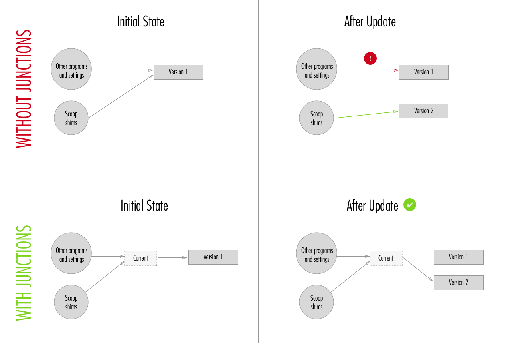

# Concepts

## Apps

Scoop uses the term 'app' to refer to an application or program to be installed. You might also see it used to loosely refer to a [manifest](#app-manifests) that describes how to install an app.

An app is a self-contained, independent unit. It contains one or more executables or scripts. But that's probably too much of an explanation—generally you'll know an app when you see it.

Probably the main reason for the term 'app' is that it only takes 3 keystrokes on 2 keys to type.

## Buckets

In Scoop, buckets are collections of apps. Or, to be more specific, a bucket is a Git repository containing JSON [app manifests](#app-manifests) which describe how to install an app.

Scoop has a [main bucket](https://github.com/lukesampson/scoop/tree/master/bucket) which is bundled with Scoop and this is always available as the primary source for installing apps.

By default, when you run `scoop install <app>`, it looks in the main bucket, but it's possible to install from other buckets too.

There's an optional [extras bucket](https://github.com/lukesampson/scoop-extras) containing apps that don't quite fit the [criteria of the main bucket](https://github.com/lukesampson/scoop/wiki/Criteria-for-including-apps-in-the-main-bucket), but are still good to have. There is also an optional 'versions' bucket containing older versions of some well-known packages.

And Scoop supports adding other buckets. Anyone can set up their own bucket with their own set of apps, and other people can add and install from this bucket—they just need to know the location of the bucket's Git repository.

### Known buckets

There is a list of known buckets by the community, those can be seen in [`buckets.json`](https://github.com/lukesampson/scoop/blob/master/buckets.json), to see the list of known buckets execute:

```powershell
scoop bucket known
```

### Installing from other buckets

If you want to install from a bucket besides the main one, you need to configure Scoop to know about the bucket. For example, to add the optional 'extras' bucket, run:

```powershell
scoop bucket add extras
```

The 'extras' bucket is a [special bucket](https://github.com/lukesampson/scoop/blob/master/buckets.json), in that it's "well known", i.e. Scoop already knows where this bucket is so you don't have to specify its location.

Just say the extras bucket wasn't well known, the way you'd add it would be:

```powershell
scoop bucket add extras https://github.com/lukesampson/scoop-extras.git
```

That is,

```powershell
scoop bucket add <name-of-bucket> <location-of-git-repo>
```

You can run `scoop help bucket` for more information on buckets.

### Creating your own bucket

Here's an example of one way you might go about creating a new bucket, using GitHub to host it. You don't have to use GitHub though—you can use whatever source control repo you like, or even just a Git repo on your local or network drive.

1. Create a new GitHub repo called my-bucket
2. Add an app to your bucket. In a powershell session:

    ```powershell
    git clone https://github.com/<your-username>/my-bucket
    cd my-bucket
    '{ version: "1.0", url: "https://gist.github.com/lukesampson/6446238/raw/hello.ps1", bin: "hello.ps1" }' > hello.json
    git add .
    git commit -m "add hello app"
    git push
    ```

3. Configure Scoop to use your new bucket:

    ```powershell
    scoop bucket add my-bucket https://github.com/<your-username>/my-bucket
    ```

4. Check that it works:

    ```powershell
    scoop bucket list # -> you should see 'my-bucket'
    scoop search hello # -> you should see hello listed under, 'my-bucket bucket:'
    scoop install hello
    hello # -> you should see 'Hello, <windows-username>!'
    ```

5. To share your bucket, all you need to do is tell people how to add you bucket, i.e. by running the command in step 3.

## App Manifests

An app manifest is a JSON file that describes how to install a program.

**A simple example:**

```json
{
  "version": "1.0",
  "url": "https://github.com/lukesampson/cowsay-psh/archive/master.zip",
  "extract_dir": "cowsay-psh-master",
  "bin": "cowsay.ps1"
}
```

When this manifest is run with `scoop install` it will download the zip file specified by `url`, extract the "cowsay-psh-master" directory from the zip file, and then make the `cowsay.ps1` script available on your path.

For more examples, see the app manifests in the [main Scoop bucket](https://github.com/lukesampson/scoop/tree/master/bucket).

- **Required Properties**

  - `version`: The version of the app that this manifest installs.
  - `url`: The URL or URLs of files to download. If there's more than one URL, you can use a JSON \* array, e.g. `"url": [ "http://example.org/program.zip", "http://example.org/dependencies.zip" ]`. URLs can be HTTP, HTTPS or FTP.

  To change the filename of the downloaded URL, you can append a URL fragment (starting with `#`) to URLs. For example,

  `"http://example.org/program.exe"` -> `"http://example.org/program.exe#/dl.7z"`

  Note the fragment must start with `#/` for this to work.

  In the above example, Scoop will download `program.exe` but save it as `dl.7z`, which will then be extracted automatically with 7-Zip. This technique is commonly used in Scoop manifests to bypass executable installers which might have undesirable side-effects like registry changes, files placed outside the install directory, or an admin elevation prompt.

- **Optional Properties**

  - `##`: A one-line string, or array of strings, containing comments.
  - `architecture`: If the app has 32- and 64-bit versions, architecture can be used to wrap the differences ([example](https://github.com/lukesampson/scoop/blob/master/bucket/7zip.json)]).
    - `32bit|64bit`: contains architecture-specific instructions (`bin`, `checkver`, `extract_dir`, `hash`, `installer`, `pre_install`, `post_install`, `shortcuts`, `uninstaller`, `url`, and `msi` [`msi` is deprecated]).
  - [`autoupdate`](App-Manifest-Autoupdate#add-autoupdate-to-a-manifest): Definition of how the manifest can be updated automatically.
  - `bin`: A string or array of strings of programs (executables or scripts) to make available on the user's path.
    - You can also create an alias shim which uses a different name to the real executable and (optionally) passes arguments to the executable. Instead of just using a string for the executable, use e.g: `[ "program.exe", "alias", "--arguments" ]`. See [busybox](https://github.com/lukesampson/scoop/blob/master/bucket/busybox.json) for an example.
    - However if you declare just one shim like this, you must ensure it's enclosed in an outer array, e.g: `"bin": [ [ "program.exe", "alias" ] ]`. Otherwise it will be read as separate shims.
  - [`checkver`](App-Manifest-Autoupdate#add-checkver-to-a-manifest): App maintainers and developers can use the [bin/checkver](https://github.com/lukesampson/scoop/blob/master/bin/checkver.ps1) tool to check for updated versions of apps. The `checkver` property in a manifest is a regular expression that can be used to match the current stable version of an app from the app's homepage. For an example, see the [go](https://github.com/lukesampson/scoop/blob/master/bucket/go.json) manifest. If the homepage doesn't have a reliable indication of the current version, you can also specify a different URL to check—for an example see the [ruby](https://github.com/lukesampson/scoop/blob/master/bucket/ruby.json) manifest.
  - `depends`: Runtime dependencies for the app which will be installed automatically. See also `suggest` (below) for an alternative to `depends`.
  - `description`: A one line string containing a short description of the program. Don’t include the name of the program, if it’s the same as the app’s filename.
  - `env_add_path`: Add this directory to the user's path (or system path if `--global` is used). The directory is relative to the install directory and must be inside the install directory.
  - `env_set`: Sets one or more environment variables for the user (or system if `--global` is used) ([example](https://github.com/lukesampson/scoop/blob/master/bucket/go.json)).
  - `extract_dir`: If `url` points to a compressed file (.zip, .7z, .tar, .gz, .lzma, and .lzh are supported), Scoop will extract just the directory specified from it.
  - `hash`: A string or array of strings with a file hash for each URL in `url`. Hashes are SHA256 by default, but you can use SHA512, SHA1 or MD5 by prefixing the hash string with 'sha512:', 'sha1:' or 'md5:'.
  - `homepage`: The home page for the program.
  - `innosetup`: set to the boolean `true` (without quotes) if the installer is InnoSetup based.
  - `installer`|`uninstaller`: Instructions for running a non-MSI installer.
    - `file`: The installer executable file. For `installer` this defaults to the last URL downloaded. Must be specified for `uninstaller`.
    - `script`: A one-line string, or array of strings, of commands to be executed as an installer/uninstaller instead of `file`.
    - `args`: An array of arguments to pass to the installer. Optional.
    - `keep`: `"true"` if the installer should be kept after running (for future uninstallation, as an example). If omitted or set to any other value, the installer will be deleted after running. See [`extras/oraclejdk`](https://github.com/lukesampson/scoop-extras/blob/master/oraclejdk.json) for an example. This option will be ignored when used in an `uninstaller` directive.
  - `license`: A string or hash of the software license for the program. For well-known licenses, please use the identifier found at [spdx](https://spdx.org/licenses/) For other licenses, use the URL of the license, if available. Otherwise, use “Freeware”, “Proprietary”, “Public Domain”, or “Shareware”, as appropriate. If multiple licenses, seperate licenses with a comma (,). If dual licensed, seperate licenses with a pipe symbol (|).
    - `identifier`: The SPDX identifier, or “Freeware”, “Proprietary”, “Public Domain”, or “Shareware”, as appropriate
    - `url`: For non-SPDX licenses, include a link to the license.
  - `notes`: A one-line string, or array of strings, with a message to be displayed after installing the app.
  - `persist` A string or array of strings of directories and files to persist inside the data directory for the app. [Persistent data](Persistent-data)
  - `pre_install` | `post_install` : A one-line string, or array of strings, of the commands to be executed before or after an application is installed. (Available variables: `$dir`, `$persist_dir`, `$version` many more (_check the `lib/install` script_))
  - `psmodule`: Install as a PowerShell module in `~/scoop/modules`.
    - `name` (required for `psmodule`): the name of the module, which should match at least one file in the extracted directory for PowerShell to recognize this as a module.
  - `shortcuts`: Specifies the shortcut values to make available in the startmenu. See [sourcetree](https://github.com/lukesampson/scoop-extras/blob/master/sourcetree.json) for an example. The array has to contain a executable/label pair. The third and fourth element are optional.
    1. Path to target file [required]
    2. Name of the shortcut (supports subdirectories: `<AppsSubDir>\\<AppShortcut>` [e.g. sysinternals](https://github.com/lukesampson/scoop-extras/blob/master/sysinternals.json)) [required]
    3. Start parameters [optional]
    4. Path to icon file [optional]
  - `suggest`: Display a message suggesting optional apps that provide complementary features. See [ant](https://github.com/lukesampson/scoop/blob/master/bucket/ant.json) for an example.
    - `["Feature Name"] = [ "app1", "app2"... ]`
      e.g. `"JDK": [ "extras/oraclejdk", "openjdk" ]`

  If any of the apps suggested for the feature are already installed, the feature will be treated as 'fulfilled' and the user won't see any suggestions.

- **Undocumented Properties**

  - `cookie`: only found [here](https://github.com/se35710/scoop-java/search?q=cookie&unscoped_q=cookie)

- **Deprecated Properties**

  - `_comment`: A one-line string, or array of strings, containing comments. Use `##` instead.
  - `extract_to`: No longer used.
  - `msi` _(deprecated)_: Settings for running an MSI installer

  **This property is deprecated and support will be removed in a future version of Scoop.** _The new method is to treat .msi files just like a .zip and extract the files from it without running the full install. You can use the new method simply by not including this `msi` property in your manifest._

  - `code` _required_: the product code GUID for the MSI installer
  - `silent`: should normally be `true` to try to install without popups and UAC prompts

### Creating an App Manifest

If you want to install a program that's not included in Scoop, it's easy to create an [app manifest](#app-manifests) yourself.

Here's how to create and install a manifest for an 'app' that says hello, in just a few lines of powershell.

```powershell
# write an app manifest to hello.json
'{ "version": "1.0", "url": "https://gist.github.com/lukesampson/6446238/raw/hello.ps1", "bin": "hello.ps1" }' > hello.json

# install the app
scoop install hello

# did it work?
hello # -> should output 'Hello, <your-username>!'
```

#### Share Your Apps

##### Share On Your Network

If you want others on your network to be able to install from your app manifest, you could just put it on a network share location, e.g. \\shared\files\scoop\hello.json. Then, for others to install your app, you can tell them to run:

```powershell
scoop install \\shared\files\scoop\hello.json
```

##### Share With The World

If you make your app manifest publicly available on the web, anyone can install it once they know the URL. For example, I've made a GitHub gist for hello.json [here](https://gist.github.com/lukesampson/6446567). Now anyone can install it:

```powershell
scoop install https://gist.github.com/lukesampson/6446567/raw/hello.json
```

#### Next steps

If you ran some of these examples, you probably noticed a warning saying 'no hash in manifest'. For reference information on specifying file hashes and much more in your manifests, see the [App Manifests reference](#app-manifests).

If you want to maintain a collection of apps, see the page on [Buckets](#buckets) for more information.

### App Manifest Autoupdate

Auto Update is a tool for package maintainers. It automatically checks for new versions of an app and updates the manifest accordingly. It helps to eliminate much of the tedium of updating manifests, as well as reducing the risk of human error while doing so.

Here you will find an in-depth explanation of how the `autoupdate` part of an app manifest works.

#### Using autoupdate

Use `checkver` to query the current version of either a specific app or all apps of a bucket.
Open a PowerShell/cmd, then `cd` into the buckets repository directory and run the following commands.

To query the current version of a specific app the bucket, run:

```powershell
cd <bucket repository>
.\bin\checkver.ps1 <app>
```

To query the current version of all apps of the main bucket, run:

```powershell
.\bin\checkver.ps1 *
```

In the output of `checkver`, you can see if an outdated app has autoupdate available. If so, you can run the following command to automatically update the respective app's manifest (using `*` will update all apps)

```powershell
.\bin\checkver.ps1 <app> -u
```

To use a bucket other than the main bucket, specify its directory as the second argument to `checkver`

```powershell
.\bin\checkver.ps1 <app> <bucket_dir> -u
```

It is recommended to verify that the updated manifest still works by installing the app with the following command

```powershell
scoop install bucket\<app>.json
```

#### Add `checkver` to a manifest

Simplest solution is to use an regex and it will match it to the source of `homepage`. Example: [7zip](https://github.com/lukesampson/scoop/blob/master/bucket/7zip.json)

- `homepage` Page where the version can be found
- `checkver` Regex for finding the version

```json
"homepage": "http://www.7-zip.org/",
"checkver": "Download 7-zip ([^\\ ]+)",
```

Use another url if the `homepage` doesn't contain the version. Example: [gradle](https://github.com/lukesampson/scoop/blob/master/bucket/gradle.json)

- `homepage` will be ignored
- `checkver.url` Page where the version can be found
- `checkver.re` or `checkver.regex` Regex for finding the version

```json
"homepage": "https://gradle.org",
"checkver": {
    "url": "https://gradle.org/install",
    "re": "The current Gradle release is version ([\\d.]+)"
},
```

Use a JSON endpoint with rudimentary JSON path expressions to retrieve the version. Example: [nuget](https://github.com/lukesampson/scoop/blob/master/bucket/nuget.json)

- `checkver.url` JSON endpoint where the version can be found
- `checkver.jp` or `checkver.jsonpath` JSON path expression for finding the version ([JSONPath Expression Tester](https://jsonpath.curiousconcept.com/))

```json
"checkver": {
    "url": "https://dist.nuget.org/index.json",
    "jp": "$.artifacts[0].versions[0].version"
},
```

Use the latest app release on Github by setting `checkver` to `github` and the `homepage` to the repository URL. This will try to match the tag with `\/releases\/tag\/(?:v)?([\d.]+)`. _The repository maintainer has to use Github's release feature for this to work. Pre-releases will be ignored!_ Example: [nvm](https://github.com/lukesampson/scoop/blob/master/bucket/nvm.json)

```json
"homepage": "https://github.com/coreybutler/nvm-windows",
"checkver": "github",
```

Or use different urls for the homepage and repository. Example: [cmder](https://github.com/lukesampson/scoop/blob/master/bucket/cmder.json)

```json
"homepage": "http://cmder.net",
"checkver": {
    "github": "https://github.com/cmderdev/cmder"
},
```

Use capture groups for complex versions and use the results in the [`autoupdate` property](#add-autoupdate-to-a-manifest).
This example will provide `$version` and `$matchShort` as variables. Example: [git](https://github.com/lukesampson/scoop/blob/master/bucket/git.json)

```json
"checkver": {
    "url": "https://github.com/git-for-windows/git/releases/latest",
    "re": "v(?<version>[\\d\\w.]+)/PortableGit-(?<short>[\\d.]+).*\\.exe"
},
```

- `checkver`: Regex for finding the version on the `homepage`
  - `url`: Page where the version can be found (supports [version variables](#version*variables))
  - `re|regex`: Regex for finding the version
  - `github`: Url to the apps Github repository
  - `jp|jsonpath`: JSON path expression for finding the version ([JSONPath Expression Tester](https://jsonpath.curiousconcept.com/))
  - `reverse: true`: match the last occurrence found (default is to match the first occurrence). Example: [x264](https://github.com/lukesampson/scoop/blob/master/bucket/x264.json#L26)
  - `replace`: replace the matched value with a calculated value. Example: [sysinternals](https://github.com/lukesampson/scoop-extras/blob/master/sysinternals.json#L9)

#### Add `autoupdate` to a manifest

For the autoupdate feature to work it needs a [`checkver` property](#add-checkver-to-a-manifest) to find the latest version number.

Some example manifests using the `autoupdate` feature:
[NodeJS](https://github.com/lukesampson/scoop/blob/master/bucket/nodejs.json),
[PHP](https://github.com/lukesampson/scoop/blob/master/bucket/php.json),
[nginx](https://github.com/lukesampson/scoop/blob/master/bucket/nginx.json),
[imagemagick](https://github.com/lukesampson/scoop/blob/master/bucket/imagemagick.json)

```json
"autoupdate": {
    "note": "Thanks for using autoupdate, please test your updates!",
    "architecture": {
        "64bit": {
            "url": "https://example.org/dl/example-v$version-x64.msi"
        },
        "32bit": {
            "url": "https://example.org/dl/example-v$version-x86.msi"
        }
    },
}
```

```json
"autoupdate": {
    "url": "https://example.org/dl/example-$version.zip"
}
```

All the options can be set globally for all architectures or for each architecture separately

- `url`: an url template for generating the new url. (supports [version variables](#version-variables))
  - Scoop will rename files by appending `#/dl.7z` or `#/pngcrush.exe` to the URL (useful for extracting installers or renaming executables version string)
- `extract_dir`: Option to update `extract_dir` (supports [version variables](#version-variables))
- `note`: Optional message to be displayed when the autoupdate command is run
- `hash`: Set this [property](#add-hash-to-autoupdate) for obtaining hash values without download the actual files.

Some examples with autoupdate and multiple `$match` variables:

- [haxe](https://github.com/lukesampson/scoop/blob/master/bucket/haxe.json)
- [openjdk](https://github.com/lukesampson/scoop/blob/master/bucket/openjdk.json)

#### Add `hash` to `autoupdate`

There are several options to obtain the hash of the new file. If the app provider publishes hash values it is possible to extract these from their website or hashfile. If nothing is defined or something goes wrong while downloading/extracting the hash values the files will be downloaded and hashed locally.

Use the same URL as the file and append `.sha256` to it. Example: [openjdk](https://github.com/lukesampson/scoop/blob/master/bucket/openjdk.json)

```json
"hash": {
    "url": "$url.sha256"
}
```

Use a different URL to checksums file (can contain multiple hashes and files). Example: [nodejs](https://github.com/lukesampson/scoop/blob/master/bucket/nodejs.json)

```json
"hash": {
    "url": "https://nodejs.org/dist/v$version/SHASUMS256.txt.asc"
}
```

Use a different regex to extract the hash.
Example: [apache](https://github.com/lukesampson/scoop/blob/master/bucket/apache.json)

```json
"hash": {
    "url": "$url.txt",
    "find": "SHA256-Checksum for: (?:$basename):\\s+([a-fA-F0-9]{64})"
}
```

Use a JSON endpoint with rudimentary JSON path expressions to retrieve the hash. Example: [openssl](https://github.com/lukesampson/scoop/blob/master/bucket/openssl.json)

```json
"hash": {
    "mode": "json",
    "jp": "$.files.$basename.sha256",
    "url": "https://slproweb.com/download/win32_openssl_hashes.json"
}
```

All the options can be set globally for all architectures or for each architecture separately

- `mode`:
  - `extract`: (default, can be omitted) download from `url` and find with the regex
  - `rdf`: extract from a RDF file. Example: [imagemagick](https://github.com/lukesampson/scoop/blob/master/bucket/imagemagick.json)
  - `json`: extract from a JSON file. Example: [openssl](https://github.com/lukesampson/scoop/blob/master/bucket/openssl.json)
  - `download`: (fallback) downloads the file and hash it locally
- `url`: URL template for downloading RDF/JSON files or extracting hashes. It supports the following variables:
  - Supports all [version variables](#version-variables)
  - `$url`: autoupdate URL without fragments (`#/dl.7z`) [e.g. `http://example.com/path/file.exe`]
  - `$baseurl`: autoupdate URL without filename and fragments (`#/dl.7z`) [e.g. `http://example.com/path`]
- `find|regex`: A regex to extract the hash from the source. [Defaults to: `^([a-fA-F0-9]+)$` and `([a-fA-F0-9]+)\s+\*?(?:$basename)`]
  - `$basename`: filename from autoupdate URL (ignores fragments `#/dl.7z`)
- `jp|jsonpath`: For JSON files: A JSON path to extract the hash from the source (Variables: `$basename`)
- `type`: Deprecated, hash type is determined automatically

#### Version variables

The following variables are available:

- `$version`: `3.7.1`
- `$underscoreVersion`: `3_7_1`
- `$dashVersion`: `3-7-1`
- `$cleanVersion`: `371`
- The `$version` (e.g. `3.7.1.2`) is splitted on each `.` and is assigned to:
  - `$majorVersion`: `3`
  - `$minorVersion`: `7`
  - `$patchVersion`: `1`
  - `$buildVersion`: `2`
- `$matchHead`: Returns first two or three digits seperated by a dot (e.g. `3.7.1-rc.1` = `3.7.1` or `3.7-rc.1` = `3.7`)
- `$matchTail`: Returns the rest of `$matchHead` (e.g. `3.7.1-rc.1` = `-rc.1` or `3.7-rc.1` = `-rc.1`)
- `$preReleaseVersion`: Everything after the first `-` (e.g. `3.7.1-rc.1` would result in `rc.1`)
- Each capturing group in the [`checkver` property](#add-checkver-to-a-manifest) adds a `$matchX` variable (named groups are allowed). Matching `v3.7.1/3.7` with [`v(?<version>[\d.]+)\/(?<short>[\d.]+)`](https://regex101.com/r/M7RP3p/1) would result in:
  - `$match1` or `$matchVersion`: `3.7.1`
  - `$match2` or `$matchShort`: `3.7`

#### Limitations

There are some complex manifests which reach the limits of the current autoupdate implementation (_The list of affected manifests is incomplete_)

- The binaries specified in the `bin` option change with the version number. Example: [pngcrush](https://github.com/lukesampson/scoop/blob/master/bucket/pngcrush.json), …
- There are multiple `url` needed to be updated. Example: [python-exp](https://github.com/lukesampson/scoop/blob/master/bucket/python-exp.json)
- The `env_set` is version dependent. Example: [sbcl](https://github.com/lukesampson/scoop/blob/master/bucket/sbcl.json)

#### Testing and running autoupdate

If you want to confirm an autoupdate works (e.g. after adding it to an existing manifest or creating a new one) change the `version` field to a lower or different version and then run or use the `-f` parameter

```powershell
cd <bucket repository>
.\bin\checkver.ps1 <app> -u
```

Check if the `url`, `extract_dir` and `hash` properties have the correct values. Try to install/uninstall the app and submit your changes.

#### Example Workflow with scoop status/update

`scoop status` compares your installed version against the current copy of scoop and bucket repository on your machine. If these are not updated it will output wrong version information. e.g.:

- installed version: 2.1.2
- local scoop version: 2.1.3
- online repo version: 2.1.4

`scoop status` will show version 2.1.3
Running `scoop update` before `scoop status` is recommended (and enforced every 3 hours). Then it will show version 2.1.4

`scoop update` just `git pull`s the main scoop repo to `~\scoop\apps\scoop\current` and every configured bucket to `~\scoop\buckets\<name>`

`bin\checkver` is only for maintenance and updating the manifests so they can be committed to the repo.

Example Workflow:

- `.\bin\checkver -dir ./ * -u` (updates all manifest in the repo)
- `git commit -m "Updated apps"`
- `git push`
- `scoop update`
- `scoop status`
- `scoop update <app>`

### Persistent Data

#### Data directory

If you need to store data which should persist between updates you should use `~/scoop/persist/<app>/`.
Inside the manifest, the path to the data directory is available in the `$persist_dir` variable.

The [PHP](/lukesampson/scoop/blob/master/bucket/php.json) package uses it for the configuration files.

#### App manifest

Directories and files can be added to the `persist` definition inside the app manifest.
Persist data is linked from the installed application directory to the data directory with directory conjunctions or hard links.

During the installation, any persistent data is copied into the data directory and linked to.

#### Definition

The `persist` definition can be a string if only one item is needed or an array for multiple items.

Optionally an item can have a different name inside the data directory

```json
{
  "persist": [
    "keeps_its_name",
    ["original_name", "new_name_inside_the_data_dir"]
  ]
}
```

#### Examples

- [MySQL](/lukesampson/scoop/blob/master/bucket/mysql.json)
- [MariaDB](/lukesampson/scoop/blob/master/bucket/mariadb.json)
- [NGINX](/lukesampson/scoop/blob/master/bucket/nginx.json)
- [node.js](/lukesampson/scoop/blob/master/bucket/nodejs.json)
- [PHP](/lukesampson/scoop/blob/master/bucket/php.json)

#### Uninstall

There is a flag to purge all persist data when you uninstall an app. By default, the data will be kept until you remove it.

```powershell
  scoop uninstall -p nodejs
```

## Dependencies

Scoop treats dependencies in a way you might not expect, especially if you're used to tools like NuGet or Bundler. These tools have to deal with complex problems around long chains of dependencies for specific versions of libraries. Scoop takes a simpler approach.

**Apps are self-contained units.**

They should keep their own copies of any libraries they need to run, and not rely on or interfere with any libraries outside their own install path.

**It's ok to just install the latest version.**

If you were to install Git manually on a new machine, would you go looking for the specific version you had on your last machine to make sure everything works correctly? Or would you just grab the latest version from their website? Scoop assumes you probably want to do the latter.

If this makes you uncomfortable, remember that unlike software libraries which can have breaking changes between minor version increments, this is less common with programs.

Of course there are some cases where an old version of a program is still widely used and the new one isn't backwards compatible, like Python versions 2 and 3. Scoop has these cases covered too: you can install the latest 2.7 version with `python27` and for the latest 3.x version it's just `python`.

**Apps depending on other apps.**

Sometimes an app needs another app to install or run properly. For example:

```latex
rust
 |
 |—— innounp required (to install)
 |    |
 |    |—— 7zip required (to install)
 |
 |—— gcc45 required (to run)
      |
      |—— 7zip required (to install)
```

In these sort of cases, when you install an app Scoop will assume you want to install anything required that you don't already have and install these automatically too.

**Install-time Dependencies vs Runtime Dependencies.**

Runtime dependencies are specified with the `depends` setting in the [app manifest](https://github.com/lukesampson/scoop/wiki/#app-manifests). Install-time dependencies are detected based on the file extensions of the `url`s in the app manifest.

Scoop treats these differently, e.g. `scoop status` only shows warnings for missing **runtime** dependencies.

**Version dependencies.**

For **software library dependencies**, Scoop just side-steps the problem of version dependencies completely, as described above.

For **app dependencies** when installing apps, Scoop assumes you want the latest stable version of any dependencies. _Again note that Scoop supports specific versions of apps too, e.g. an app could have a dependency on `python27` (Python v2.7), or `python` (the latest stable version of Python)._ For updating apps, Scoop just does the bare minimum—if a dependency is completely missing it will install it, but if it's on an older version Scoop will leave it alone.

## Version Alias

### Current Version Alias

The `current` directory for apps is a special alias directory which points to the currently installed version of that app.

It allows path references to remain the same across app updates, since paths refer to the `current` directory alias rather than a hardcoded version directory.


For example, if I run `ls ~/scoop/apps/git` now, I see this output:

```powershell
$ ls ~/scoop/apps/git

    Directory: C:\Users\luke\scoop\apps\git

Mode                LastWriteTime         Length Name
----                -------------         ------ ----
d-----         24/11/16   8:17 am                2.10.2.windows.1
d-----           3/1/17   9:42 am                2.11.0.windows.1
d----l           3/1/17   9:42 am                current
```

The `2.10.2.windows.1` and `2.11.0.windows.1` directories are the installed versions of Git.

The `current` directory is not an additional directory, but a **Directory Junction**, pointing to the 2.11.0.windows.1 directory.

If you're paying close attention, you might notice the extra `l` in the `Mode` column of the output. But apart from that, you won't see much indication that it's any different from a normal directory.

### Directory Junctions

If you're not familiar with directory junctions, you can think of them as similar to symbolic links, or even shortcuts. They are pointers to other locations in the file system. There are some important implementation differences between junctions and symbolic links, which you can read about [here](<https://msdn.microsoft.com/en-us/library/windows/desktop/aa365006(v=vs.85).aspx>) if you're interested.

The reason Scoop uses junctions instead of symbolic links is that symbolic links require admin permissions to create (although this [looks set to change soon](https://blogs.windows.com/buildingapps/2016/12/02/symlinks-windows-10/#cpLA6xrKTwb5fOf7.97)).

### Shims Aren't Enough

The main problem being addressed here is how to keep programs working smoothly between updates, even though the new program is in a different directory to the previous one. Shims do solve some of the problems here, by staying in the same place and updating the version that they point to.

However, some programs need to set environment variables, registry settings or other configuration after installation that point to the actual install path. Before Scoop used `current` directory junctions, these variables and settings would be pointing to the old directory after an upgrade, which was not ideal. By using a `current` alias directory and updating the alias, the settings would continue to point to the right location.


